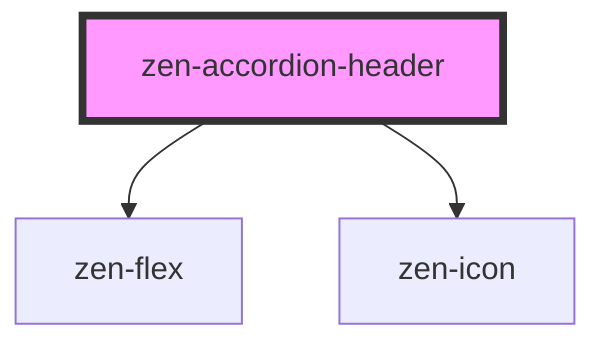

# zen-accordion-header

<!-- Auto Generated Below -->

## Events

| Event    | Description | Type                                         |
| -------- | ----------- | -------------------------------------------- |
| `toggle` |             | `CustomEvent<HTMLZenAccordionHeaderElement>` |

## Dependencies

### Depends on

- [zen-flex](../zen-flex)
- [zen-icon](../zen-icon)

### Graph

----------------------------------------------

*Built with [StencilJS](https://stenciljs.com/)*
