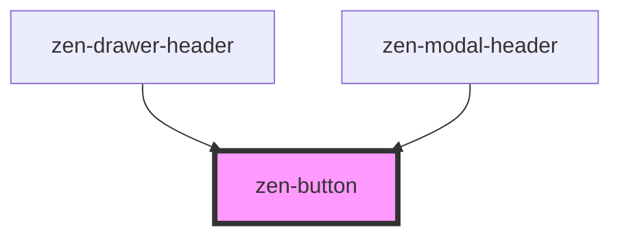

# zen-button

<!-- Auto Generated Below -->

## Properties

| Property   | Attribute  | Description | Type      | Default     |
| ---------- | ---------- | ----------- | --------- | ----------- |
| `accent`   | `accent`   |             | `boolean` | `undefined` |
| `disabled` | `disabled` |             | `boolean` | `undefined` |
| `plain`    | `plain`    |             | `boolean` | `undefined` |
| `primary`  | `primary`  |             | `boolean` | `undefined` |
| `size`     | `size`     |             | `string`  | `undefined` |

## Dependencies

### Used by

 - [zen-drawer-header](../zen-drawer-header)
 - [zen-modal-header](../zen-modal-header)

### Graph

----------------------------------------------

*Built with [StencilJS](https://stenciljs.com/)*
