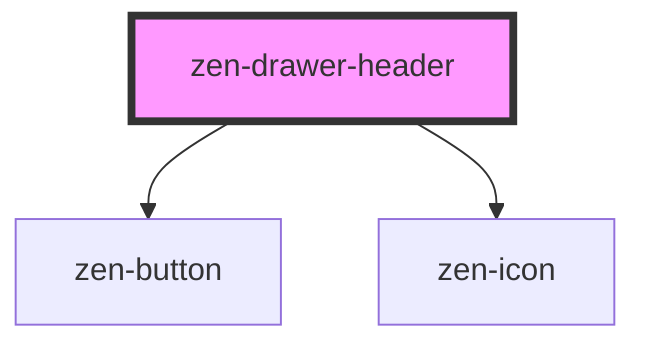

# zen-drawer-header

<!-- Auto Generated Below -->

## Properties

| Property       | Attribute        | Description | Type      | Default |
| -------------- | ---------------- | ----------- | --------- | ------- |
| `showCloseBtn` | `show-close-btn` |             | `boolean` | `true`  |

## Events

| Event   | Description | Type                |
| ------- | ----------- | ------------------- |
| `close` |             | `CustomEvent<void>` |

## Dependencies

### Depends on

- [zen-button](../zen-button)
- [zen-icon](../zen-icon)

### Graph

----------------------------------------------

*Built with [StencilJS](https://stenciljs.com/)*
