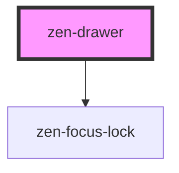

# zen-drawer

<!-- Auto Generated Below -->

## Properties

| Property              | Attribute                | Description | Type                                     | Default     |
| --------------------- | ------------------------ | ----------- | ---------------------------------------- | ----------- |
| `closeOnOverlayClick` | `close-on-overlay-click` |             | `boolean`                                | `true`      |
| `fullscreen`          | `fullscreen`             |             | `boolean`                                | `undefined` |
| `open`                | `open`                   |             | `boolean`                                | `undefined` |
| `overlay`             | `overlay`                |             | `boolean`                                | `true`      |
| `placement`           | `placement`              |             | `"bottom" \| "left" \| "right" \| "top"` | `'right'`   |
| `size`                | `size`                   |             | `string`                                 | `'md'`      |

## Events

| Event   | Description | Type                |
| ------- | ----------- | ------------------- |
| `close` |             | `CustomEvent<void>` |

## Dependencies

### Depends on

- [zen-focus-lock](../zen-focus-lock)

### Graph

----------------------------------------------

*Built with [StencilJS](https://stenciljs.com/)*
