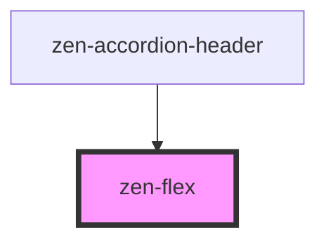

# zen-flex

<!-- Auto Generated Below -->

## Properties

| Property    | Attribute   | Description | Type                                                                                            | Default     |
| ----------- | ----------- | ----------- | ----------------------------------------------------------------------------------------------- | ----------- |
| `align`     | `align`     |             | `"baseline" \| "center" \| "flex-end" \| "flex-start" \| "stretch"`                             | `undefined` |
| `direction` | `direction` |             | `"column" \| "column-reverse" \| "row" \| "row-reverse"`                                        | `'row'`     |
| `justify`   | `justify`   |             | `"center" \| "flex-end" \| "flex-start" \| "space-around" \| "space-between" \| "space-evenly"` | `undefined` |
| `wrap`      | `wrap`      |             | `"nowrap" \| "wrap" \| "wrap-reverse"`                                                          | `'nowrap'`  |

## Dependencies

### Used by

 - [zen-accordion-header](../zen-accordion-header)

### Graph

----------------------------------------------

*Built with [StencilJS](https://stenciljs.com/)*
