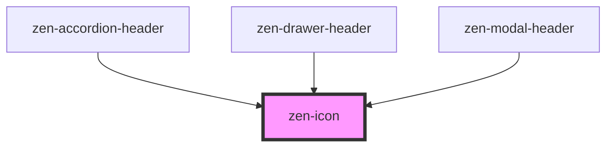

# zen-icon

<!-- Auto Generated Below -->

## Properties

| Property | Attribute | Description | Type     | Default     |
| -------- | --------- | ----------- | -------- | ----------- |
| `color`  | `color`   |             | `string` | `"black"`   |
| `icon`   | `icon`    |             | `string` | `undefined` |
| `size`   | `size`    |             | `string` | `"md"`      |

## Dependencies

### Used by

 - [zen-accordion-header](../zen-accordion-header)
 - [zen-drawer-header](../zen-drawer-header)
 - [zen-modal-header](../zen-modal-header)

### Graph

----------------------------------------------

*Built with [StencilJS](https://stenciljs.com/)*
