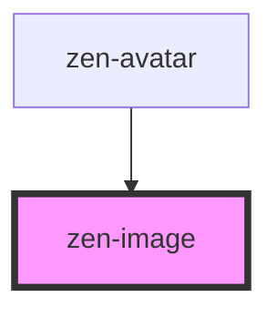

# zen-image

<!-- Auto Generated Below -->

## Properties

| Property      | Attribute      | Description | Type     | Default     |
| ------------- | -------------- | ----------- | -------- | ----------- |
| `altText`     | `alt-text`     |             | `string` | `undefined` |
| `fallbackSrc` | `fallback-src` |             | `string` | `undefined` |
| `imgSrc`      | `img-src`      |             | `string` | `undefined` |

## Dependencies

### Used by

 - [zen-avatar](../zen-avatar)

### Graph

----------------------------------------------

*Built with [StencilJS](https://stenciljs.com/)*
