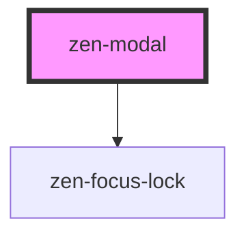

# zen-modal

<!-- Auto Generated Below -->

## Properties

| Property              | Attribute                | Description | Type      | Default     |
| --------------------- | ------------------------ | ----------- | --------- | ----------- |
| `centered`            | `centered`               |             | `boolean` | `undefined` |
| `closeOnOverlayClick` | `close-on-overlay-click` |             | `boolean` | `true`      |
| `height`              | `height`                 |             | `string`  | `'100%'`    |
| `open`                | `open`                   |             | `boolean` | `undefined` |
| `overlay`             | `overlay`                |             | `boolean` | `true`      |
| `size`                | `size`                   |             | `string`  | `'md'`      |

## Events

| Event   | Description | Type                |
| ------- | ----------- | ------------------- |
| `close` |             | `CustomEvent<void>` |

## Dependencies

### Depends on

- [zen-focus-lock](../zen-focus-lock)

### Graph

----------------------------------------------

*Built with [StencilJS](https://stenciljs.com/)*
